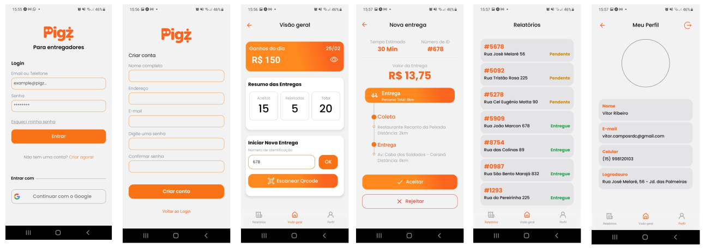

# Aplicativo de Entregas - Pigz!

<h1 align="center">
  
</h1> 

Projeto de estudo desenvolvido através do template do aplicativo de entregas Pigz.  

### 🛠 Tecnologias

As seguintes ferramentas foram usadas na construção do projeto:
- [React Native](https://reactnative.dev/)
- [JavaScript](https://developer.mozilla.org/pt-BR/docs/Web/JavaScript)
- [BottomTabs Navigator](https://reactnavigation.org/docs/bottom-tab-navigator/)
- [Stack Navigator](https://reactnavigation.org/docs/stack-navigator)
- [TawilindCSS / Nativewind](https://www.nativewind.dev/)
- [Context API](https://reactjs.org/docs/context.html)

### 👨🏾‍💻 Autor
---

 

Feito com ❤️ por Vitor Ribeiro 👋🏽 Entre em contato!

